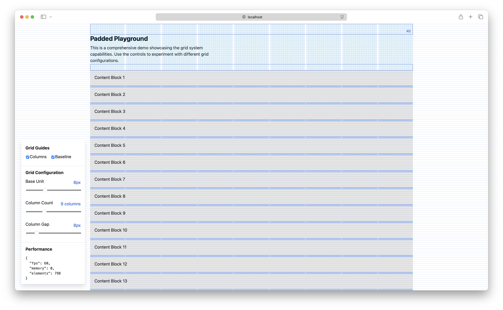

# Baseline Kit

Baseline Kit is a lightweight development tool for visualizing and debugging grid systems and spacing in React applications. It provides configurable overlays for both column-based and baseline grids, flexible layout components, and theme-aware configuration—all optimized for performance and built with TypeScript.



## Features

-  🎯 **Interactive Guide Overlays:** Easily toggle grid overlays (both horizontal and vertical) to ensure precise alignment in your layouts.
-  📏 **Dynamic Layout Components:** Flexible components like Layout, Flex, Box, and Padder provide consistent spacing and alignment.
-  🧩 **Grid System Components:** New Layout component for CSS Grid-based layouts with automatic column calculations.
-  📐 **Flex Layout Support:** Flex component for flexible box layouts with built-in baseline alignment.
-  🔄 **Responsive Design:** Components automatically adapt to container dimensions and base unit configuration.
-  🎨 **Configurable & Themed:** Leverage the Config component and hooks such as useConfig to easily override default settings.

## Installation

```shell
npm install baseline-kit

```

## Quick Start

Below is an example that demonstrates how to integrate Baseline Kit into your React application for both grid overlays
and spacing management:

```tsx
import React from 'react'
import { Config, Guide, Baseline, Box, Spacer } from 'baseline-kit'
import 'baseline-kit/styles.css'

function App() {
  const isDev = process.env.NODE_ENV === 'development'
  const debugMode = isDev ? 'visible' : 'hidden'

  return (
    <Config>
      {/* Baseline Grid for typography alignment */}
      <Baseline config={{ base: 8, height: "100vh" }} debugging={debugMode} />

      {/* Column Grid Overlay */}
      <Guide
        variant="pattern"
        columns={['100px', '200px', '100px']}
        gap={2}
        debugging={debugMode}
        align="center"
        width="1200px"
      />

      {/* Box container that aligns its children to the baseline grid */}
      <Box debugging="visible" block={[16, 16]} inline={8}>
        <h1>Content Aligned to the Grid</h1>
        <p>This box uses a consistent baseline spacing.</p>
      </Box>

      {/* Spacer component for dynamic spacing */}
      <Spacer
        height="16px"
        width="100%"
        config={{ base: 8, color: "#ff0000" }}
        visibility="visible"
      />

      <main>Your main content goes here...</main>
    </Config>
  )
}

export default App
```

## Components & API

### Config

The **Config** component provides a theme context for all Baseline Kit components. It allows you to override default
values such as the base unit, colors, and debugging modes.

#### Usage

```tsx
<Config base={16} guide={{ debugging: 'visible' }}>
  {/* Components that consume the config */}
  <Guide />
  <Baseline />
</Config>
```

All configuration hooks (e.g. useConfig) will pull values from this context.

### Guide

The **Guide** component overlays a vertical grid to help you visualize column-based layouts.

#### Variants

- **line**: Renders evenly spaced vertical lines.
- **pattern**: Uses a custom array of column widths (e.g. ['1fr', '2fr', '1fr']).
- **fixed**: Renders a fixed number of columns.
- **auto**: Automatically calculates columns based on a given column width.

#### Props Example

```tsx
<Guide
  variant="pattern"
  columns={['100px', '200px', '100px']}
  gap={2}
  debugging="visible"
  align="center"
  width="1200px"
/>
```

Internally, the Guide component calculates the CSS grid template, gap, and column count based on container size and the
provided configuration.

### Baseline

The **Baseline** component overlays an horizontal grid for aligning typography and vertical spacing.

#### Props Example

```tsx
<Baseline
  config={{ base: 8, height: "100vh" }}
  debugging="visible"
/>
```

### Box

The **Box** component is a container component that aligns its content to the baseline grid. It leverages both the
useBaseline hook and the global configuration.

#### Props Example

```tsx
<Box debugging="visible" block={[11, 5]}>
  <p>Content aligned to the baseline grid!</p>
</Box>
```

### Padder

The **Padder** component applies consistent spacing (or padding) around its children. In debug mode, it renders visual
indicators for the padding boundaries.

#### Props Example

```tsx
<Padder block={16} inline={8} debugging="visible">
  <p>Inside a padded area.</p>
</Padder>
```

### Spacer

The **Spacer** component provides flexible space between elements. It adjusts its dimensions based on the configured
base unit and can optionally display measurement indicators in debug mode.

#### Props Example

```tsx
<Spacer
  height="16px"
  width="100%"
  config={{ base: 8, color: "#ff0000" }}
  debugging="visible"
/>
```

## Core Concepts

### Grid Calculations

**Baseline Kit** supports various methods of grid calculation:

- **Fixed Columns:** Define a fixed number of equally-sized columns.
- **Pattern Columns:** Use an array of column widths to define a repeating pattern.
- **Auto-Calculated Columns:** Automatically determine the number of columns based on container width and a specified
  column width.
- **Line Variant:** Renders single-pixel lines for precise alignment.

## Debugging Modes

The library supports three debugging modes:

- **visible:** Overlays and debug visuals are fully rendered.
- **hidden:** Debug elements are present but not visible.
- **none:** Debugging is disabled; no extra elements are rendered.

These modes can be toggled via component props or via the global configuration.

## Performance & Compatibility

- **Performance:** All grid calculations and measurements are throttled and optimized using requestAnimationFrame to
  minimize reflows and ensure smooth rendering.
- **Browser Support:** Baseline Kit works in modern browsers (Chrome, Firefox, Safari, Edge) with support for CSS Grid
  Layout and CSS Custom Properties.
- **Tree-Shakeable:** The library is optimized for modern bundlers and supports tree-shaking.

## License

MIT © [François Denavaut](https://github.com/dnvt)
