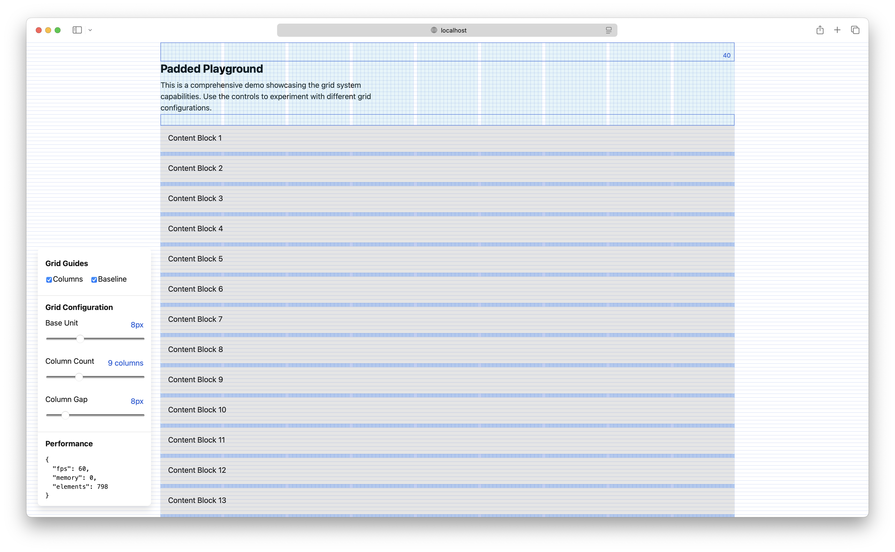

# Baseline Kit


Baseline Kit is a lightweight development tool for visualizing and debugging grid systems and spacing in React applications. It provides configurable overlays for both column-based and baseline grids, spacing primitives, and theme-aware configuration—all optimized for performance and built with TypeScript. The library is based on the "Padded Grid" concept, originally explored in [this article](http://medium.com/design-bootcamp/the-padded-grid-a-designers-hack-to-achieve-baseline-fit-fc40d022bc84) on achieving perfect baseline alignment in digital layouts.



## Table of Contents
  - [Features](#features)
  - [Requirements](#requirements)
  - [Installation](#installation)
  - [Quick Start](#quick-start)
  - [Core Concepts](#core-concepts)
    - [Base Unit](#base-unit)
    - [Spacing Values](#spacing-values)
    - [Grid Snapping](#grid-snapping)
    - [Debugging Modes](#debugging-modes)
  - [Components](#components)
    - [Component Hierarchy](#component-hierarchy)
    - [Key Components](#key-components)
      - [Config](#config)
      - [Baseline](#baseline)
      - [Guide](#guide)
      - [Box](#box)
  - [Theme System](#theme-system)
    - [CSS Import Options](#css-import-options)
    - [Theme Options](#theme-options)
    - [Theme Variables Reference](#theme-variables-reference)
  - [Browser Support](#browser-support)
  - [React 19 Features](#react-19-features)
  - [Server-Side Rendering (SSR)](#server-side-rendering-ssr)
    - [SSR-Friendly Design](#ssr-friendly-design)
    - [SSR Mode Prop](#ssr-mode-prop)
  - [Development](#development)
  - [Performance Features](#performance-features)
  - [Contributing](#contributing)
  - [License](#license)

## Features

- 📏 **Baseline Grid:** Core system for maintaining vertical rhythm and consistent spacing across your layouts
- 🎯 **Column Grid Guide:** Customizable overlay system for visualizing column-based layouts and alignment
- 📦 **Box Component:** Basic container with configurable spacing that snaps to the baseline grid
- 🧱 **Padder & Spacer:** Spacing primitives with optional baseline snapping
- 🎨 **Theme System:** Customizable colors and debug visuals through a centralized configuration

## Requirements

- **React 19**: Baseline Kit is built for React 19 and uses the latest React features like the `use` hook
- **Modern Browsers**: Supporting the latest CSS features

## Installation

```shell
# Using npm
npm install baseline-kit

# Using yarn
yarn add baseline-kit

# Using pnpm
pnpm add baseline-kit
```

After installation, import the smallest entry point that matches your use case.
For a development grid overlay, use the guide-only React and CSS subpaths:

```tsx
import 'baseline-kit/styles/guide'
import { Config, Guide } from 'baseline-kit/guide'
```

For frameworks like Remix that use URL imports in a links function:

```tsx
export const links = () => [
  { rel: 'stylesheet', href: 'baseline-kit/styles/guide' },
]
```

For the full component set, import the root package and root component styles:

```tsx
import 'baseline-kit/styles'
import 'baseline-kit/theme'
import { Config, Guide, Baseline, Box } from 'baseline-kit'
```

If you prefer a single CSS file for every component plus the theme:

```tsx
import 'baseline-kit/styles/full'

// For Remix:
export const links = () => [
  { rel: 'stylesheet', href: 'baseline-kit/styles/full' },
]
```

The browser reset is not included by default. Import `baseline-kit/reset` or
`baseline-kit/styles/reset` only when you want Baseline Kit to provide one.

Baseline Kit is written in TypeScript and includes built-in type definitions—no additional packages required.

## Quick Start

```tsx
import React from 'react'
import { Config, Guide, Baseline, Box } from 'baseline-kit'

function App() {
  const isDev = process.env.NODE_ENV === 'development'
  const debugging = isDev ? 'visible' : 'hidden'

  return (
    <Config
      base={8}
      baseline={{ debugging }}
      box={{ debugging }}
      guide={{ debugging }}
      spacer={{ debugging }}
    >
      {/* Baseline Grid for typography alignment */}
      <Baseline
        height="100vh"
        debugging="visible"
      />

      {/* Column Grid Guide */}
      <Guide
        variant="pattern"
        columns={['100px', '200px', '100px']}
        gap={16}
        align="center"
        width="1200px"
      />

      {/* Box with baseline alignment */}
      <Box
        block={[2, 5]}
        debugging="visible"
      >
        <h1>Content Aligned to the Grid</h1>
      </Box>

      <main>Your main content goes here...</main>
    </Config>
  )
}
```

## Core Concepts

### Base Unit

The base unit is the foundation of Baseline Kit's spacing system. All measurements are calculated as multiples of this
unit:

```tsx
<Config base={8}>     // Sets 8px as the base unit
  <Padder
    block={17}        // Will be rounded to 16px (2 * base)
    inline={22}       // Will be rounded to 24px (3 * base)
  >
    {/* Content automatically aligned to the 8px grid */}
  </Padder>
</Config>
```

### Spacing Values

Spacing props (`block`, `inline`, `gap`) accept values in three formats:

```
// Single number (applies to both sides)
block={16}                  // 16px top and bottom

// Array [start, end]
block={[2, 3]}                // 2px top, 3px bottom

// Object with explicit values
block={{ start: 2, end: 3 }}  // Same as above
```

### Grid Snapping

Components automatically adjust their spacing to maintain baseline grid alignment:

- **Box**: Adjusts bottom padding to ensure total height aligns with base unit
- **Padder**: Snaps padded content to baseline-aligned multiples of the base unit

### Debugging Modes

Three modes are available for development and testing:

```tsx
debugging = "visible"        // Shows all grid lines and measurements
debugging = "hidden"         // Elements exist but are invisible
debugging = "none"           // Removes debug elements entirely
```

## Components

### Component Hierarchy

#### 1. Spacing primitives

- **`Box`** Basic container that snaps its height to the baseline grid
- **`Padder`** Padding wrapper that snaps padded content to baseline multiples
- **`Spacer`** Fixed-size spacer with optional measurement indicator overlay

#### 2. Debug overlays

- **`Baseline`** Horizontal baseline-grid overlay
- **`Guide`** Column-grid overlay (line / pattern / fixed / auto variants)

#### 3. Configuration

- **`Config`** Theme and settings provider (base unit, colors, debug modes)

### Key Components

#### Config

```tsx
<Config
  base={8}                         // Base unit for calculations
  baseline={{ debugging }}         // Baseline grid visibility
  guide={{ debugging }}            // Guide customization
>
  {children}
</Config>
```

#### Baseline

```tsx
<Baseline
  height="100vh"          // Overlay height
  variant="line"          // "line" or "flat"
  debugging="visible"     // Show the grid overlay
/>
```

#### Guide

```tsx
<Guide
  variant="pattern"                     // "line", "pattern", "fixed", or "auto"
  columns={['100px', '1fr', '100px']}   // Column definition
  gap={8}                               // Gap value
  width="1200px"                        // Container width
/>
```

#### Box

```tsx
<Box
  block={[2, 5]}         // Vertical padding in base units
  span={2}               // Grid column span when placed in a CSS grid parent
  snapping="height"      // "none", "height", or "clamp"
>
  <p>Content aligned to baseline grid</p>
</Box>
```

## Theme System

Baseline Kit comes with a flexible CSS structure and theming system:

1. `guide.css` - Guide-only overlay styles (imported via `baseline-kit/styles/guide`)
2. `styles.css` - Root component styles and base variables (imported via `baseline-kit/styles`)
3. `theme.css` - Color variables and theming with automatic dark mode support (imported via `baseline-kit/theme`)
4. `reset.css` - Optional browser reset (imported via `baseline-kit/reset` or `baseline-kit/styles/reset`)
5. `baseline-kit.css` - Combined root component styles and theme (imported via `baseline-kit/styles/full`)

### CSS Import Options

Baseline Kit gives you flexibility in how you include the styles:

```tsx
// Guide-only overlay styles
import 'baseline-kit/styles/guide'

// Root component styles and theme separately
import 'baseline-kit/styles'
import 'baseline-kit/theme'

// Root component styles and theme in one file
import 'baseline-kit/styles/full'

// Optional reset
import 'baseline-kit/reset'
```

### Theme Options

You now have four options for using the theme system:

#### 1. Use the Built-in Theme (with automatic dark mode)

```tsx
import 'baseline-kit/theme' // Default theme with light/dark mode support
```

#### 2. Use Specific Theme Variants

```tsx
// Use only the light theme (no dark mode)
import 'baseline-kit/theme/default'

// Use only the dark theme
import 'baseline-kit/theme/dark'

// Example: Apply dark theme regardless of system preference
import 'baseline-kit/styles'
import 'baseline-kit/theme/dark'
```

#### 3. Create a Custom Theme

You can use the tokens template as a starting point:

```tsx
// First check the token template to see available variables
import 'baseline-kit/theme/tokens' // Just for reference (contains no values)
```

Then create your own custom theme file:

```css
/* yourCustomTheme.css */
:root {
  /* Component-specific colors */
  --bk-baseline-color-line-theme: hsla(210, 100%, 50%, 0.15);
  --bk-baseline-color-flat-theme: hsla(270, 100%, 60%, 0.2);
  /* Add other component colors as needed */
}

/* Optional dark mode support */
@media (prefers-color-scheme: dark) {
  :root {
    --bk-baseline-color-line-theme: hsla(210, 100%, 50%, 0.2);
  }
}
```

Then import your custom theme:

```tsx
import 'baseline-kit/styles' // Required component styles
import './path/to/yourCustomTheme.css' // Your custom theme
```

#### 4. Override via Config

For minor adjustments, use the Config component:

```tsx
<Config
  baseline={{
    colors: {
      line: 'rgba(255,0,0,0.1)',   // Custom red baseline lines
      flat: 'rgba(255,0,0,0.05)',  // Custom red baseline backgrounds
    }
  }}
>
  {/* Your components here */}
</Config>
```

### Theme Variables Reference

| Component | Variable Pattern | Purpose |
|-----------|-----------------|---------|
| Baseline  | `--bk-baseline-color-[line/flat]-theme` | Colors for lines and backgrounds |
| Guide     | `--bk-guide-color-[line/pattern/auto/fixed]-theme` | Colors for different guide variants |
| Box       | `--bk-box-color-[line/flat/text]-theme` | Colors for borders, backgrounds and text |
| Spacer    | `--bk-spacer-color-[line/flat/text]-theme` | Colors for borders, backgrounds and text |
| Padder    | `--bk-padder-color-theme` | Padder edge color |

See the [tokens file](https://github.com/dnvt/baseline-kit/blob/main/dist/theme/tokens.css) for a complete list of available variables.

## Browser Support

- Modern browsers (Chrome, Firefox, Safari, Edge)
- Requires CSS Grid Layout support and CSS Custom Properties
- Falls back gracefully in unsupported browsers

## React 19 Features

Baseline Kit leverages React 19's latest features:
- **`use` Hook**: Replaces `useContext` for better performance and cleaner code
- **Streamlined Context API**: Uses the simplified Context Provider syntax
- **JSX Transform**: Takes advantage of the mandatory JSX transform in React 19

These modern features allow for cleaner code and better performance, but require React 19.

## Server-Side Rendering (SSR)

Baseline Kit is fully compatible with React's Server-Side Rendering in frameworks like Next.js, Remix, and other React Router-based applications.

### SSR-Friendly Design

Components are designed to:
- Provide consistent rendering between server and client
- Avoid hydration mismatches by using deterministic initial values
- Progressively enhance with client-side measurements after hydration
- Work with frameworks that use streaming SSR

### SSR Mode Prop

Components accept an `ssrMode` prop to explicitly optimize for server rendering:

```tsx
<Baseline
  height="100vh"
  ssrMode={true}
  debugging="visible"
/>
```

With `ssrMode` enabled, components use simplified rendering during SSR and initial hydration, then enhance with full features after client-side hydration completes.
For debug overlays such as `Guide` and `Baseline`, `ssrMode` keeps the simplified fallback markup to avoid client measurement and row/column rendering in SSR-sensitive paths.

## Development

```shell
# Clone the repository
git clone --recurse-submodules https://github.com/dnvt/baseline-kit.git

# If you already cloned without submodules
git submodule update --init --recursive

# Install dependencies
bun install

# Start development server
bun run dev

# Run tests
bun run test
```

The `.maestro` directory is a workflow submodule. Generated local workflow
surfaces such as `.claude/`, `maestro/`, `progress/`, and `plans/` are ignored.

## Performance Features

- Virtualizes large grid overlays
- Client-side only rendering for dynamic components
- Optimized resize event handling
- Optimizes re-renders using React.memo and useMemo
- Supports tree-shaking for minimal bundle size

## Contributing

Please see [CONTRIBUTING.md](./CONTRIBUTING.md) for detailed guidelines.

## License

MIT © [François Denavaut](https://github.com/dnvt)
